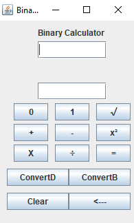

# BinaryCalculator
This is a calculator that can add, subtract, multiply, divide, square, and square root binary numbers. \
\
All buttons should be self-explanatory \
[Nick] [Created repo, added others as collaborators, toDecimal and toBinary functions, some UI] \
[Justin] [Created UI] \
[Erick] [Created multiply and divide functions] \
[Jakob] [Created square and squareRoot functions] \
[Joshua] [Created add and subtract functions] \
Only group meeting was Tuesday, September 8th at 2:30 pm, via discord, where responsibilities were assigned.

